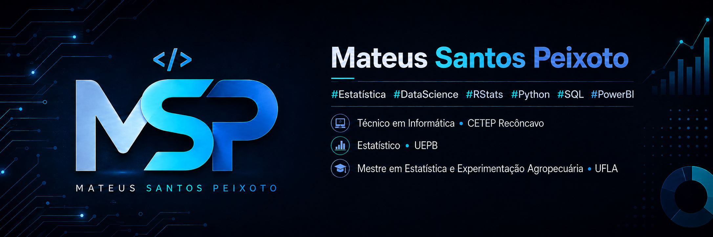

<p align="center">
  
</p>


<h3 align="center">
  Tecnologia • Desenvolvimento • Dados • Aprendizado Contínuo
</h3>

<p align="center">
  Transformando aprendizado em projetos e projetos em experiência.
</p>

---

## 👨‍💻 Sobre mim

Sou técnico em Informática pelo CETEP Recôncavo, graduado em Estatística pela Universidade Estadual da Paraíba (UEPB) e mestre em Estatística e Experimentação Agropecuária pela Universidade Federal de Lavras (UFLA). Ao longo da minha formação, desenvolvi interesse por Estatística Espacial, modelagem preditiva, Ciência de Dados e tecnologia.

No mestrado, trabalhei com regressão espacial Tobit aplicada à análise dos casos de tuberculose em Minas Gerais, fortalecendo meu interesse por aplicações estatísticas voltadas a problemas reais.

Tenho sólida experiência com R e atualmente venho ampliando meus conhecimentos em Python, SQL e Power BI. Gosto de explorar dados, aprender novas tecnologias e desenvolver soluções que conectem estatística, programação e tomada de decisão.
Fora do ambiente acadêmico e profissional, tenho como principais hobbies jogos, texnologia, viagens, natureza, filmes e séries.

- 💻 Desenvolvimento e programação
- 📊 R
- 🐍 Python
- 🗄️ SQL e Banco de Dados
- 🌐 Desenvolvimento Web
- 🤖 Inteligência Artificial
- 📈 Power BI e Visualização de Dados

---

## 🛠️ Tecnologias

<p align="center">


</p>

---

## 🚀 Projetos em Destaque

### 📊 Análise de Dados em R
Projeto utilizando R para tratamento, exploração e visualização de dados.

**Tecnologias:** R • tidyverse • dplyr • ggplot2 • tidyr

[📁 Ver repositório](https://github.com/MateusSP25/AnalisesR)

[📄 Ver script principal](https://github.com/MateusSP25/AnalisesR/blob/main/Estat%C3%ADstica%20descritiva.R)

---

### 🐍 Análise de Dados em Python
Projeto utilizando Python para tratamento, exploração e visualização de dados.

**Tecnologias:** Python • Pandas • NumPy • Matplotlib

[📁 Ver repositório](https://github.com/MateusSP25/AnalisesPython)

[📄 Ver script principal](https://github.com/MateusSP25/AnalisesPython/blob/main/python/analise.py)

---

### 🗄️ Banco de Dados e SQL
Projetos envolvendo modelagem de dados, consultas SQL, JOINs, filtros e agregações.

[📁 Ver repositório](https://github.com/MateusSP25/AnalisesSQL)

[📄 Ver script principal](https://github.com/MateusSP25/AnalisesSQL/blob/main/SQL/Analise_de_Vendas.sql)

---

### 🌐 Desenvolvimento Web
Projeto de aplicação web responsiva utilizando HTML, CSS e JavaScript.

**Tecnologias:** HTML • CSS • JavaScript

[🔗 Ver projeto](LINK_DO_REPOSITORIO)

---

[](https://github.com/MateusSP25)

---
[](https://github.com/MateusSP25)
---

## 📚 Atualmente estudando

```text
R
Python
SQL
Power BI
Git e GitHub
Inteligência Artificial

